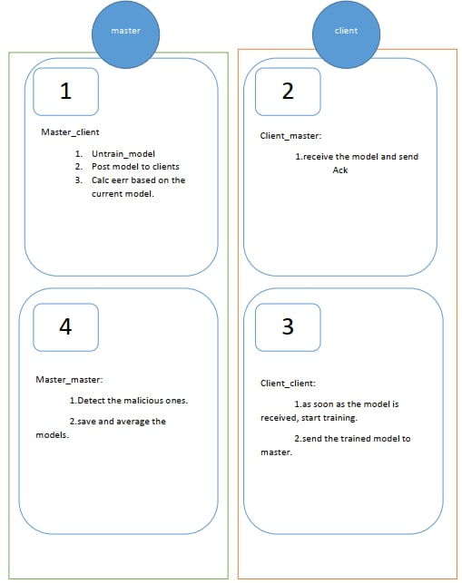

# Distributed_learning
<div id="top"></div>
<!--
*** Thanks for checking out my code. If you have a suggestion
*** that would make this better, please fork the repo and create a pull request
*** or simply open an issue with the tag "enhancement".
*** Don't forget to give the project a star!
*** Thanks again! 
-->


### Install

* [Anaconda Prompt](https://anaconda.org/conda-forge/prompt)


<p align="right">(<a href="#top">back to top</a>)</p>


<!-- GETTING STARTED -->
## Getting Started

This is an example of how you may set up a real implementation of distributed learning on real devices (e.g. Jetson TX2).
To get a local copy up and running follow these simple example steps.

### Prerequisites

This is an example of how to list things you need to use the software and how to install them.
* conda
  ```sh
  conda install numpy jupyter
  conda install pytorch torchvision -c pytorch
  conda install -c conda-forge matplotlib
  conda install -c anaconda flask
  ```

### Anaconda prompt

Provide Virtual Environment on devices:
   ```sh
   conda env remove -n ENV_NAME
   conda create -n py python anaconda
   conda install tensorflow-gpu opencv-python jupyter matplotlib tqdm
   conda install -c anaconda cudatoolkit
   conda install tensorflow-gpu opencv-python jupyter matplotlib tqdm numpy 
   ```
   


<p align="right">(<a href="#top">back to top</a>)</p>


<!-- USAGE EXAMPLES -->
## Usage

This code is a complete implementation of a real world distributed learning. Please change the IP address based on the devices. 

### IP Linux (Terminal)
ifconfig -a
### IP Win (CMD)
ipconfig -a


<!-- CONTRIBUTING -->
## Contributing
Any contributions you make are **greatly appreciated**.

If you have a suggestion that would make this better, please fork the repo and create a pull request. You can also simply open an issue with the tag "enhancement".

<p align="right">(<a href="#top">back to top</a>)</p>


<!-- LICENSE -->
## License

Distributed under the MIT License. See `LICENSE.txt` for more information.

<p align="right">(<a href="#top">back to top</a>)</p>


<!-- CONTACT -->
## Contact

Omid Milani - omidhalimimilani@gmail.com

<p align="right">(<a href="#top">back to top</a>)</p>


<!-- ACKNOWLEDGMENTS -->
## General View

<p align="right">(<a href="#top">back to top</a>)</p>



